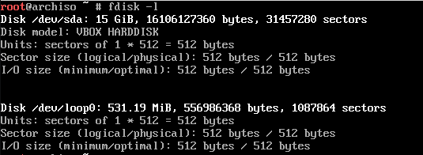
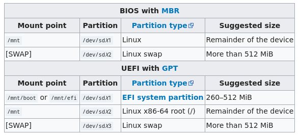
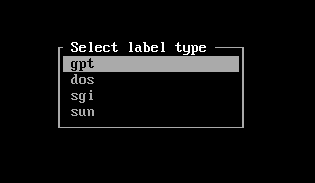
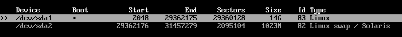
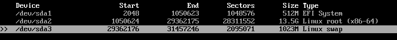

# 01 - Primeiros passos

Depois de ter lido os aquivos anteriores e estar ciente do necessário, conecte o pendrive na sua máquina, inicie o ambiente live e vamos a parte que nos interessa.

## Layout do teclado

Por padrão no ambiente live do Arch o padrão do teclado é US (se o seu for US pode pular essa parte), então vamos mudar para o modelo **br-abnt2**.

```console
# loadkeys br-abnt2
```

Este comando serve para carregarmos qualquer layout disponivel. Verifique os modelos utilizando seguinte comando `ls /usr/share/kbd/keymaps/**/*.map.gz`.

## Modo de boot

Para montarmos nosso sistema é extremamente necessário sabermos o modo de boot da nossa máquina.

Para verificar se nosso modo de boot é UEFI basta utilizarmos o seguinte comando:

```console
# ls /sys/firmware/efi/efivars
```

Se o arquivo não existir seu modo de boot é BIOS.

## Conectar a internet

Tenha certeza que sua placa de rede esta ligada utilizando o comando ip link.

```console
# ip link
```

### Conexão cabeada

Se você esta utilizando uma conexão cabeada, provavelmente, você já tem acesso a internet.

### Conexão sem fio

Para se conectar a internet por uma rede sem fio basta utilizar o seguinte comando:

```console
# wifi-menu
```

Escolha sua rede e conecte-se e em seguida utilize o comando ping para testar.

```console
# ping google.com
```

## Particionamento de disco

Como ja sabemos nosso modo de boot, agora nós precisamos escolher o disco que iremos particionar. Para listar o disco usamos o comando:

```console
# fdisk -l
```

Vai retornar algo parecido com isto (resultados terminados em room, loop ou airoot não importa para nós):



*A quantidade de discos pode variar de acordo com quantos discos você tem em sua maquina.*

No meu caso irei instalar o arch no disco `/dev/sda`.

Nós precisamos de uma partição para o diretório raiz `/`, porém se o modo de boot do seu sistema for UEFI é necessário criar partições EFI também. Vamos olhar a tabela de montagem da wiki.



Agora que ja sabemos os pontos de montagem, podemos particionar o disco.

```console
# cfdisk /dev/sda
```

Algo desse tipo pode retornar para você:



O é gpt para UEFI e dos para BIOS.

*Obs: eu prefiro usar o cfdisk para fazer as partições mas se quiser usar o fdisk não tem problema.*

### BIOS

Se seu modo de boot for BIOS, você deve criar duas partições (uma para swap e outra para a pasta raiz).

Suas partições devem estar semelhantes a isto:



Agora é só salvar, sair e vamos formatar as partições e ligar nossa swap:

```console
# mkfs.ext4 /dev/sda1

# mkswap /dev/sda2
# swapon /dev/sda2
```

Pronto agora que ja particionamos e formatamos, vamos montar nossa partição.

```console
# mount /dev/sda1 /mnt
```

### UEFI

Se seu modo de boot for UEFI, você deverá criar três partições (uma para EFI, uma para a swap e outra para pasta raiz)

Suas partições devem estar semelhantes a isto:



Agora é só salvar, sair e vamos formatar as partições:

```console
# mkfs.fat -F32 /dev/sda1
# mkfs.ext4 /dev/sda2
# mkswap /dev/sda3
# swapon /dev/sd3
```

Pronto agora que ja particionamos e formatamos, vamos montar nossas partições.

```console
# mount /dev/sda2 /mnt
# mkdir -p /mnt/boot/efi
# mount /dev/sda1 /mnt/boot/efi
```

Vamos parando por aqui pois terminamos nossos primeiros passos antes da instalação, vamos para o [próximo arquivo](../3-Instalacao/1-Essencial.md)!

---

### Referências

[Wiki - Pre installation](https://wiki.archlinux.org/index.php/Installation_guide#Pre-installation)