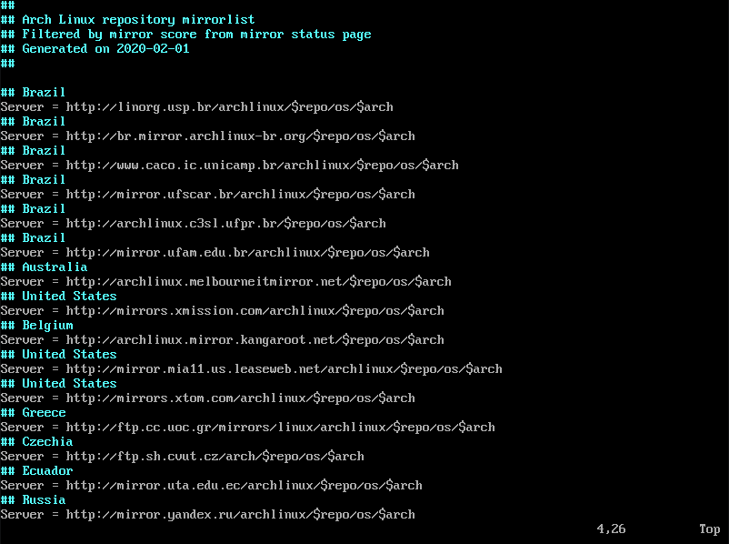

# 01 - Pacotes essenciais

Bom, agora chegamos na parte que de fato vamo instalar nosso sistema vamos em frente.

## Mirrors

Os mirrors estão localizados em `/etc/pacman.d/mirrorlist` e são utilizados para fazermos os downloads dos pacotes no nosso sistema então você pode querer alterar e
deixar o mirrors brasileiros com maior prioridade pois quando instalarmos nosso sistema essa lista de mirrors será copiada. Eu não tenho o costume de alterar os mirrors, é mais uma coisa pessoal, mas alterá-los é bem simples, vamos lá.

Escolha um editor de texto que você deseja, no meu caso usarei o vim.

```console
# vim /etc/pacman.d/mirrorlist
```

*Obs: esta lista de mirrors é gerada de acordo com a velocidade de sincronização de quando a iso foi criada.*

Estando dentro do arquivo de mirrors, agora basta somente você mover os mirrors desejados para cima ou comentar os outros espelhos, no meu caso vou move-los para cima.

Depois de move-los sua lista deve parecer com isto.



Agora com nossos mirrors brasileiros com maior prioridade, podemos continuar com a instalação.

## Pacotes Essênciais

Chegou a hora de instalarmos de fato o conteúdo do nosso sistema, para fazermos isso nós utilizamos o comando `pacstrap`, este comando é o responsavel por baixar e instalar os pacotes.

Nós vamos instalar os pacotes base, linux e linux-firmware dentro da pasta onde montamos nosso sistema.

```console
# pacstrap /mnt base linux linux-firmware
```

* O pacote *base* contém todo o necessário para que nosso sistema funcione.
* O pacote *linux* é o nosso kernel, então se você deseja instalar outro kernel substitua-o.
* O pacote *linux-firmware* não contém pacotes específicos, então se deseja instalar algum firmware em especial você deverá passar juntamente a esta lista de pacote.

Esta parte costuma demorar um pouco, isso vai de acordo com a sua internet, então enquanto você espera baixar e instalar os pacotes da uma passada na [He4rt Developers](https://discord.io/He4rt) ou da uma olhada nos outros tutoriais [4noobs](https://github.com/he4rt/4noobs) temos contéudo de qualidade para vocês e te vejo no [próximo arquivo](../4-Configuracao/1-Fstab.md) :)

---

### Referências

[Wiki - Instalação](https://wiki.archlinux.org/index.php/Installation_guide#Installation)
