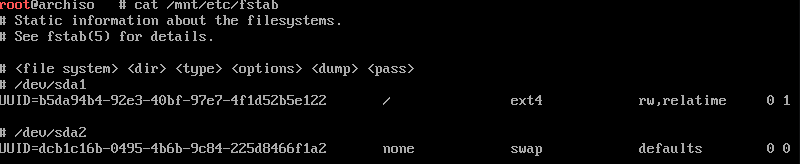
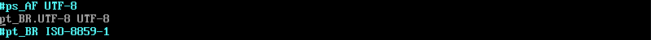

# 01 - Fstab, Time Zone e Localização

Depois de ter baixado e instalado os pacotes essenciais no [arquivo anterior](../3-Instalacao/1-Essencial) nós precisamos logar no nosso sistema e começarmos as configurações, então vamos lá.

## Fstab

Como sabemos, o arquivo fstab pode ser utilizado para definir quais partições, ou sistemas de arquivos remotos serão montados. Então vamos gerar este arquivo.

```console
# genfstab -U /mnt >> /mnt/etc/fstab
```

_Obs: tenha certeza que você ligou a swap, se não ela não será definida neste arquivo._

Para checarmos se deu tudo certo, é somente utilizar o seguinte comando.

```console
# cat /mnt/etc/fstab
```

Irá retorar o conteúdo do arquivo com nossas partições e o local onde serão montadas, semelhante a este.



## Chroot

Bom agora que ja definimos nossas partições, vamos logar no nosso sistema como root.

```console
# arch-chroot /mnt
```

E pronto, estamos dentro do nosso Arch e logado como root, simples né ?

Antes de continuarmos precisamos instalar um editor de texto para conseguirmos prosseguir com a instalação.

```console
# pacman -S vim
```

ou se preferir o nano

```console
# pacman -S nano
```

Com o editor de sua preferência instalado, podemos prosseguir

## Time zone

Agora vamos configurar nosso relógio, primeiro vamos gerar um link da nossa região.

```console
# ln -sf /usr/share/zoneinfo/America/Sao_Paulo /etc/localtime
```

_Obs: o horario de Brasília é definido como Sao_Paulo no ArchLinux._

Agora vamos gerar o arquivo `/etc/adjtime`.

```console
# hwclock --systohc
```

_obs: este comando também sincroniza com o horario da BIOS._

Recomendo instalar o pacote `ntp` para sincronizar o relógio com a internet

```console
# pacman -S ntp
```

## Localização

Agora vamos configurar o idioma do sistema, para isso precisamos acessar o arquivo `locale.gen` e descomentar a linguagem que queremos.

```console
# vim /etc/locale.gen
```

Para deixar o sistema em PT-BR, basta descomentar a linha "pt_BR.UTF-8 UTF8".



Pronto, agora salve o arquivo e vamos gerar o arquivo.

```console
# locale-gen
```

Podemos também definir a variável de linguagem utilizando o seguinte comando.

```console
# echo LANG=pt_BR.UTF-8 >> /etc/locale.conf
```

Também podemos definir o layout do teclado do sistema.

```console
# echo KEYMAP=br-abnt2 >> /etc/vconsole.conf
```

Agora já configuramos onde nossas partições serão montadas, nosso relógio e nossa linguagem do sistema e te vejo no [próximo arquivo](./2-Network.md) para configurarmos a rede.

---

### Referências

[Wiki - Configure the system](https://wiki.archlinux.org/index.php/Installation_guide#Configure_the_system)
