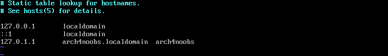
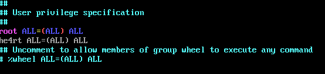

# 02 - Network e Usuários

Para configurarmos a rede do nosso sistema precisamos instalar alguns pacotes.

```console
# pacman -S networkmanager network-manager-applet wpa_supplicant
```

Se você utiliza redes sem fio é necessario instalar o pacote `wireless_tools` junto aos outros.

Com estes pacotes instalados, vamos dar um nome a nossa maquina.

```console
# echo arch4noobs >> /etc/hostname
```

Troque pelo nome que você desejar, no meu caso é arch4noobs.

Agora vamos configurar a rede e para isso vamos editar o arquivo `/etc/hosts`.

```console
# vim /etc/hosts
```

Seu arquivo deve estar semelhante a isto.



*Obs: troque o arch4noobs pelo nome que você colocou no arquivo /etc/hostname.*

Pronto, agora vamos fazer com que nossa rede esteja funcionando quando iniciarmos nossa maquina.

```console
# systemctl enable NetworkManager
```

## Usuários

Para definirmos a senha do usuário root é bem simples, basta utilizar commando `passwd`.

```console
# passwd
```

*Obs: não esqueça essa senha !!!*

Agora vamos criar nosso usuário e definir uma senha a ele.

```console
# useradd -m he4rt
# passwd he4rt
```

*Obs: adicionamos o grupo wheel ao usuário para restringir a execução do su.*

E para terminarmos vamos adicionar nosso usuário aos sudoers e para isso vamos instalar o pacote `sudo`.

```console
# pacman -S sudo
```

Depois de instalado basta adicionarmos nosso usuário ao arquivo `/etc/sudoers`

```console
# vim /etc/sudoers
```

Desça um pouco o arquivo e adicione seu usuário abaixo ao usuário root.



E pronto terminamos de configurar a rede, a senha do root e adicionamos nosso usuário, podemos ir para o [próximo arquivo](./3-Grub.md).

---

### Referências

[Wiki - Network Configuration](https://wiki.archlinux.org/index.php/Network_configuration)